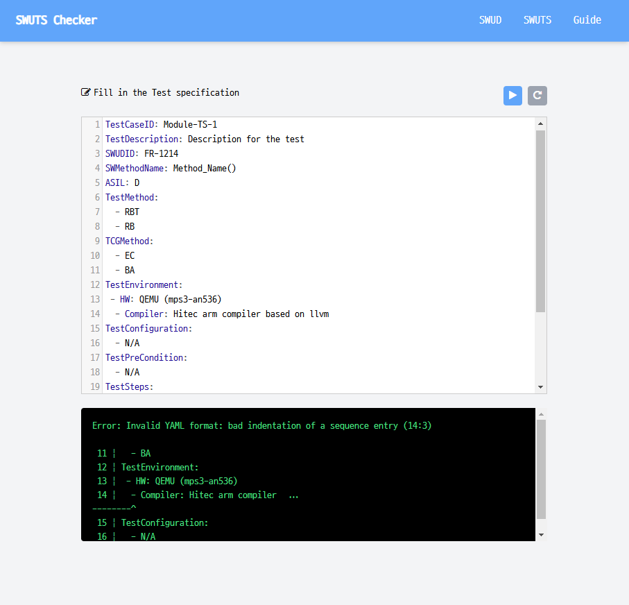

# SWUTS-Checker

## What is SWUTS-Checker?


* Follow YAML syntax
* Korean is not allowed (vectorCAST notes do not support Korean)
* Ensure that each field contains valid values


## Dev information
### Install nvm
* Install node version manager for nodejs, npm

### How to create output.css
```
npm i
npx @tailwindcss/cli -i ./input.css -o ./output.css --watch
```
